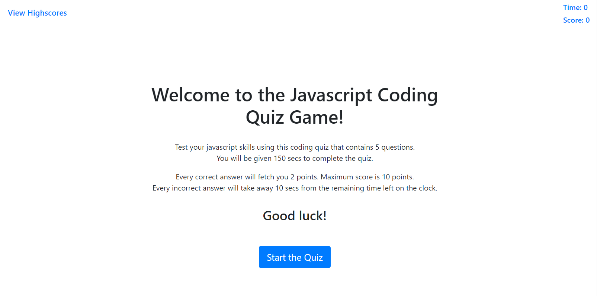
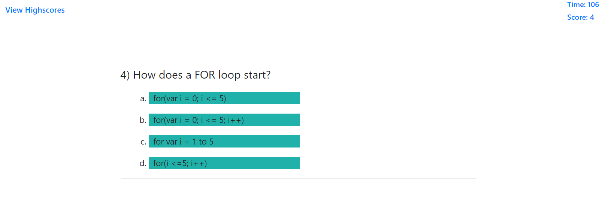
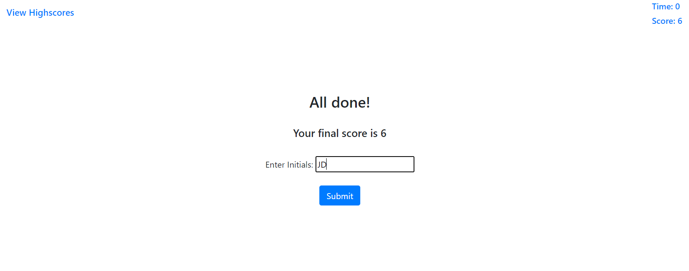
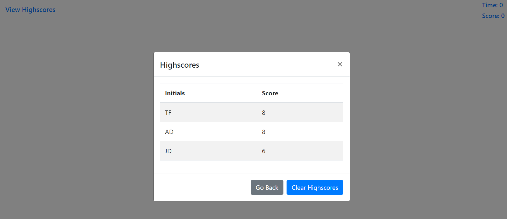

# code-quiz
A timed and scored javascript built code quiz application that tests the javascript fundamentals and saves the user high scores using client-side local storage.

## User Story

```
AS A coding boot camp student
I WANT to take a timed quiz on JavaScript fundamentals that stores high scores
SO THAT I can gauge my progress compared to my peers
```


## Acceptance Criteria

```
GIVEN I am taking a code quiz
WHEN I click the start button
THEN a timer starts and I am presented with a question
WHEN I answer a question
THEN I am presented with another question
WHEN I answer a question incorrectly
THEN time is subtracted from the clock
WHEN all questions are answered or the timer reaches 0
THEN the game is over
WHEN the game is over
THEN I can save my initials and score
```

## Description

This application is a timed quiz game that tests the Javascript coding skills of the player/user. The quiz contains 5 multi-choice questions that need to be answered within 150 secs. The player/user scores 2 points for every correct answer, with a maximum of 10 points. For every incorrect answer, there is a penalty in the form of time reduction, i.e. 10 secs are taken away from the remaining time left in the quiz. The player also has the ability to save his score and view how he performed compared to others in the Highscores list, which can be accessed by clicking on the View Highscores link/button in the application. From within the Highscores modal, the player also has the ability to clear the highscores, which will clear the entire list.

- The application will run in the browser and has a clean, polished and responsive user interface.
- The application features dynamically updated HTML and CSS powered by Javascript code.
- The application uses the browser's local storage to store and retreive the Highscore values.

## Additional Considerations

- Used Bootstrap classes for a few components.
- Refactored and reorganized the code for better presentation.
- Added comments/pseudo-code to help understand the logic.
- Used semantic HTML for search engine optimization and accessibility, wherever possible.
- Used the W3C MarkUp Validation service (https://validator.w3.org/) to validate the HTML file and no errors were reported.


## For Review

* Deployed Application URL: https://jesaldm.github.io/code-quiz/.
* Github Repository URL: https://github.com/JesalDM/code-quiz
* Application functionality demo: 
* Screenshots : 
  - 
  - 
  - 
  - 


